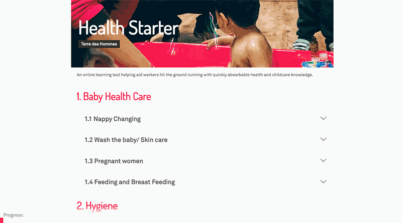

# HealthStarter

Helping aid workers hit the ground running with quickly absorbable health and childcare knowledge

## Setup 

1. Clone repo `git clone git@github.com:empowerhack/HealthStarter.git`
2. Run command in cli `pip install virtualenv` 
3. cd into `ENV/` folder
4. Run command in cli `source bin/activate`
5. To run the django server `cd hackathon`
6. Run command in cli `python manage.py runserver`
7. View application visit `http://127.0.0.1:8000` in your browser. 

And hey presto site should be there.
